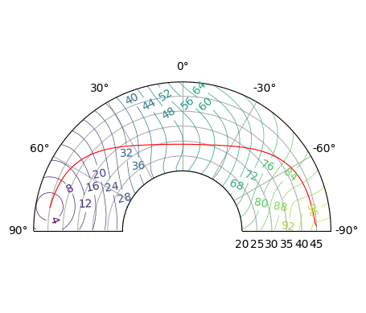

<h1 align="center"><b><i>PyFMM</i></b></h1>

<p align="center">
  <a href="https://pyfmm.readthedocs.io/zh-cn/latest/?badge=latest">
    
  </a>
  <a href="https://zenodo.org/doi/10.5281/zenodo.13823187">
    
  </a>
  
  
  
  

</p>


<p align="center">
  
  
</p>

**欢迎Star！**

[**PyFMM**](https://github.com/Dengda98/PyFMM) 是一个基于 **Fast Marching/Sweeping Method** 求解程函方程 $|\nabla T|^2 = s^2$ 的C/Python程序包，包括示例和注释。  其中 **Fast Sweeping Method** 包括了并行版本，详见[**在线文档**](https://pyfmm.readthedocs.io/zh-cn/latest/)或文献 [(Zhao, 2007)](https://www.jstor.org/stable/43693378)。

[**PyFMM**](https://github.com/Dengda98/PyFMM) is a C/Python package for solving eikonal equation using Fast Marching Method, with examples and annotations.  

**PyFMM** 目前可在Linux、Mac系统上运行，在Windows系统上可借助[WSL](https://learn.microsoft.com/en-us/windows/wsl/)、[WinLibs](https://winlibs.com/)等工具运行。

----

我还制作了一个简易图形界面 [**PyFMM-GUI**](https://github.com/Dengda98/PyFMM-GUI) 计算二维走时场，初学者可更好的理解射线追踪，也可更方便、直观地看到不同速度场下射线的扭曲形态。


-------
</br>

我主要使用 **PyFMM** 计算地震波从震源出发在复杂介质中传播形成的初至波走时场，
并使用梯度下降获得满足费马原理的射线路径，故代码中的一些术语偏专业性。
类似的原理也可用于其它方面，如计算点到曲线/面的距离，或光学、电磁学等。


+ **Python语言的便携、可扩展性与C语言的计算高效特点结合**。
  C程序被编译链接成动态库 *libfmm.so* ，**PyFMM** 再基于Python的 [ctypes](https://docs.python.org/3/library/ctypes.html)
  标准库实现对C库函数的调用。再基于第三方库 [NumPy](https://numpy.org/)、 
  [SciPy](https://scipy.org/) 等可很方便地完成对C程序结果的数据整合；


+ C代码采取模块化编写，各功能分在不同代码文件中，方便移植到其它程序；


+ 支持二维和三维情况；2D and 3D


+ 支持直角坐标系和球坐标系；Cartesian and Spherical Coordinate


+ 中文注释及示例；

<br>

# 安装 Installation 


## For Linux or Mac 
要求系统上有`gcc`，`make`开发工具。有多种下载方式：
+ **从[PYPI](https://pypi.org/project/pyfmm-kit/)下载（推荐）**  
  **最新更新，已将PyFMM程序源码同步到[PYPI](https://pypi.org/project/pyfmm-kit/)，可直接运行：**  
  ```bash
  pip install -v pyfmm-kit
  ```  
  进行安装，-v选项以查看源码的编译进度。各操作平台的wheels后续会逐步支持。

+ 从Github下载安装，安装有两个选择：
  + **不提前下载程序包**  

    要求你当前环境中有git工具。这样可直接运行
    ```bash
    # vx.x.x指代Release中的版本号，建议下载最新稳定版本
    pip install -v git+https://github.com/Dengda98/PyFMM@vx.x.x 
    # 若网速不好可改为gitee镜像
    # pip install -v git+https://gitee.com/Dengda98/PyFMM@vx.x.x
    ```


  + **提前下载好程序包** 

    注意代码主页更新频繁，**建议在[Release](https://github.com/Dengda98/PyFMM/releases)中下载最新稳定版本**，不推荐clone，不推荐直接下载主分支。在下载解压后，在程序根目录下运行
    ```bash
    pip install -v .
    ``` 

这样可安装到你的虚拟环境中。 

## For Windows 
尽管我仍然建议在Linux或Mac上运行，不过经过测试和调整，借助于WSL、WinLibs等工具，**PyFMM**可以在Windows系统上运行。这里介绍两种方法：

+ [WSL](https://learn.microsoft.com/en-us/windows/wsl/)（**推荐**）  
  WSL可以简单理解为Windows上的更轻便简洁的Linux虚拟机。安装见[WSL](https://learn.microsoft.com/en-us/windows/wsl/)链接，建议使用WSL2版本。在WSL中，安装**PyFMM**的方法就和在[Linux](#for-linux-or-mac)中一样了。事实上，由于条件受限，我就是在WSL上开发的**PyFMM**。

+ [WinLibs](https://winlibs.com/)  
  WinLibs可认为是GCC+[MinGW-w64](http://mingw-w64.org/)的集成体，可以在Windows平台使用Linux中的工具。无需安装，二进制文件均已打包好。  
  1、下载[WinLibs](https://winlibs.com/) (with POSIX threads)(UCRT)，解压后将文件夹放在合适目录，将路径下的`bin`目录路径添加到`PATH`环境变量。     
  2、将`bin`目录中的`mingw32-make.exe`原地复制一份，并改名为`make.exe`。    
  3、此时在Windows的终端上就可以运行`gcc`和`make`命令，之后安装**PyFMM**的方法就和在[Linux](#for-linux-or-mac)中一样了。


## 关于一些安装问题  

+ Q：安装过程没发现问题，但在Python中运行`import pyfmm`报错：
    ```
    OSError: dlopen(...) ... (no such file) ... (mach-o file, but is anincompatible architecture (have 'arm64', need 'x86_64'))
    ```
    
  A：这是安装编译的PyFMM和系统架构不匹配，属于比较少见的情况。正常情况下，不论Mac的芯片是Intel(x86_64)还是Apple Silicon(arm64)，编译C库时编译器会自动匹配架构。如果出现上述特殊情况，可以手动修改Makefile，在编译时指定架构，具体为  
    + 下载 **PyFMM** 程序包
    + 在 `pyfmm/C_extension/Makefile` 中修改编译器为`CC = clang` （似乎`gcc`不太好做交叉编译），将编译选项增加为`CFLAGS = --target=x86_64-apple-darwin ...(其它不变)`  
    + 在程序根目录下，运行`pip install -v .`重新安装
  这样更改后重新安装，就可解决架构不匹配的问题。**如果你是类似问题，可以在`CFLAGS`中指定其它架构，详见[clang编译器说明](https://clang.llvm.org/docs/CrossCompilation.html)。**


<br>

# 文档 Documents
为方便使用，我建立了[**在线文档**](https://pyfmm.readthedocs.io/zh-cn/latest/)，包括简易安装、API的介绍以及使用示例。  

<br>


# 其它
代码是我在研二写的，如果遇到bug，欢迎联系我(zhudengda@mail.iggcas.ac.cn)，我会完善！
也欢迎提出建议和更多示例！

基于PyFMM的体波走时反演以及面波反演后续也会开源。
