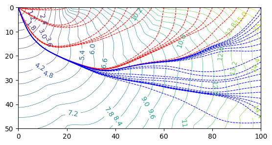

<h1 align="center"><b><i>PyFMM</i></b></h1>

  
  

  
  

<!-- 
 -->

**PyFMM**是一个基于Fast Marching Method求解程函方程 $|\nabla T|^2 = s^2$ 的C/Python程序包，包括示例和注释。  
**PyFMM** is a C/Python package for solving eikonal equation using Fast Marching Method, with examples and annotations.  

+ **Python语言的便携、可扩展性与C语言的计算高效特点结合**。
  C程序被编译链接成动态库 *libfmm.so* ，**PyFMM** 再基于Python的 [ctypes](https://docs.python.org/3/library/ctypes.html)
  标准库实现对C库函数的调用。再基于第三方库 [NumPy](https://numpy.org/)、 
  [SciPy](https://scipy.org/) 等可很方便地完成对C程序结果的数据整合；

+ C代码采取模块化编写，各功能分在不同代码文件中，方便移植到其它程序；

+ 支持二维和三维情况；

+ 支持直角坐标系和球坐标系；

+ 中文注释及示例；

# 文档 Documents
为方便使用，我建立了 [在线文档](https://pyfmm.readthedocs.io/zh-cn/latest/)，包括简易安装、API的介绍以及使用示例。  

# 其它
代码是我在初学时写的，如果遇到bug，欢迎联系我，我会完善！
也欢迎提出建议和更多示例！
